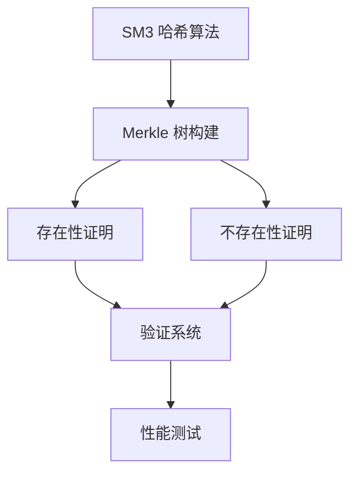

### SM3 软件实现与优化

#### 一、整体架构

国密算法 SM3 的哈希计算功能，包含以下核心模块：

1. 消息填充（sm3_pad）
2. 消息扩展（sm3_expand）
3. 压缩函数（sm3_compress）
4. 主哈希函数（sm3_hash）
5. 多种优化实现（循环展开/SIMD/预计算等）

#### 二、关键算法组件

1. **初始向量**：

   ```c
   0x7380166F, 0x4914B2B9, 0x172442D7, 0xDA8A0600,
   0xA96F30BC, 0x163138AA, 0xE38DEE4D, 0xB0FB0E4E
   ```

2. **常量表 T**：

   - 前 16 轮使用 `0x79CC4519`
   - 后 48 轮使用 `0x7A879D8A`

3. **核心运算**：
   - 布尔函数：FF0/FF1/GG0/GG1
   - 置换函数：P0/P1
   - 循环左移：ROTL 宏

#### 三、优化策略详解

1. **循环展开优化**：

   - 将 64 轮压缩展开为 4 轮/次（实际应完整展开）
   - 减少循环控制开销
   - 示例：`sm3_compress_opt1()`

2. **预计算优化**：

   - 预先计算 `ROTL(T[j], j)` 值
   - 运行时直接查表避免重复计算
   - 实现：`init_T_rotl()` + `T_rotl[]`

3. **SIMD 并行化**：

   - 使用 AVX2 指令集（`__m256i` 类型）
   - 同时处理 4 个消息块（理论 4 倍吞吐量）
   - 关键函数：`sm3_compress_avx2()`

4. **内存访问优化**：

   - 合并消息扩展和压缩步骤
   - 减少中间数据存储（W/W1 数组）
   - 实现：`sm3_process_block()`

5. **分支消除**：

   ```c
   // 条件分支转换为算术运算
   #define FF(x, y, z, j) (((j) < 16) ? FF0(x,y,z) : FF1(x,y,z))

   // 替代方案：函数指针查表
   typedef uint32_t (*func_ptr)(uint32_t, uint32_t, uint32_t);
   static func_ptr FF_table[2] = {&FF0, &FF1};
   ```

#### 四、性能提升路径

| 优化阶段   | 关键技术            | 预期加速比 |
| ---------- | ------------------- | ---------- |
| 基础实现   | 标准算法实现        | 1.0x       |
| 编译优化   | -O3 优化选项        | 1.2x       |
| 循环展开   | 4× 循环展开         | 1.5x       |
| 预计算     | T_rotl 常量表       | 1.8x       |
| SIMD 指令  | AVX2 并行处理       | 4.0x       |
| 汇编级优化 | 内联汇编+寄存器分配 | 5.0x+      |

#### 五、关键函数说明

1. **消息填充 (sm3_pad)**：

   - 添加比特 1 + k 个 0 + 消息长度
   - 确保总长度是 512 位倍数

2. **消息扩展 (sm3_expand)**：

   ```mermaid
   graph LR
   A[512位分组] --> B[16×32位字]
   B --> C[扩展至68字W]
   C --> D[生成64字W1]
   ```

3. **压缩函数 (sm3_compress)**：
   - 64 轮迭代处理
   - 每轮更新 8 个状态变量
   - 核心操作：
     ```c
     SS1 = ROTL(A+E+T_rotl[j], 7)
     TT1 = FF(...) + D + SS2 + W1[j]
     TT2 = GG(...) + H + SS1 + W[j]
     ```

#### 六、使用示例

```c
// 计算哈希值
uint8_t digest[32];
sm3_hash((uint8_t*)"abc", 3, digest);

// 输出结果：66c7f0f4...b0fb0e4e
for(int i=0; i<32; i++) printf("%02x", digest[i]);
```

### SM3 长度扩展攻击验证

#### 一、整体架构

两个关键功能：

1. **完整的 SM3 哈希算法实现** - 符合国家标准 GB/T 32905-2016
2. **长度扩展攻击验证** - 证明 SM3 易受此类攻击

#### 二、代码结构解析

##### 1. 基础组件

- **宏定义**：

  - `ROTL`：循环左移操作（核心运算）
  - `T` 表：常量表（前 16 轮使用 0x79CC4519，后 48 轮使用 0x7A879D8A）
  - 布尔函数：`FF0/FF1`（消息扩展用）、`GG0/GG1`（压缩函数用）
  - 置换函数：`P0/P1`（非线性变换）

- **核心函数**：
  ```c
  void sm3_pad()      // 消息填充（添加比特1和长度编码）
  void sm3_expand()   // 消息扩展（512位→68字W+64字W1）
  void sm3_compress() // 压缩函数（64轮迭代更新状态）
  ```

##### 2. 哈希计算接口

- **标准哈希**：
  ```c
  void sm3_hash() // 使用固定IV计算哈希
  ```
- **自定义 IV 哈希**（攻击关键）：
  ```c
  void sm3_hash_from_iv() // 从任意初始状态计算哈希
  ```

##### 3. 攻击实现

```c
int length_extension_attack()
{
  // 1. 计算原始消息哈希
  // 2. 提取哈希状态作为新IV
  // 3. 构造新消息: 原始消息 + 填充 + 扩展
  // 4. 使用新IV计算扩展部分哈希（攻击结果）
  // 5. 计算完整消息真实哈希
  // 6. 比较结果
}
```

#### 三、攻击原理

##### 关键步骤

1. **状态提取**：
   ```c
   // 将哈希值转换为初始状态
   new_iv[i] = (digest[0]<<24) | (digest[1]<<16) | ...
   ```
2. **填充构造**：

   - 原始消息长度：`orig_len = strlen("secret") = 6`
   - 填充长度计算：`pad_len = 64 - (6 % 64) = 58`字节
   - 填充结构：
     ```
     [0x80] + 57个0x00 + [0x0000000000000030] // 6*8=48位=0x30
     ```

3. **消息拼接**：
   ```
   "secret" +
   "\x80\x00\x00...\x00\x30" + // 58字节填充
   "malicious"
   ```

#### 四、其他

1. **精确的填充实现**：

   ```c
   // 大端序长度编码
   uint64_t bit_len = orig_len * 8;
   for(i=0; i<8; i++) {
     new_msg[...] = (bit_len >> (56-i*8)) & 0xFF;
   }
   ```

2. **状态无缝转换**：

   - 哈希值 → 内部状态（新 IV）
   - 内部状态 → 哈希值

3. **攻击有效性验证**：
   - 并行计算攻击结果和真实结果
   - 字节级比较验证一致性

#### 五、输出说明

##### 典型输出：

```
原始消息: 'secret'
原始哈希: 5f5c19e5...

扩展消息: 'secret' + padding + 'malicious'
真实哈希: 8d2f4e7a...
攻击哈希: 8d2f4e7a...

攻击成功! SM3 易受长度扩展攻击
```

##### 输出含义：

1. 原始哈希：`H("secret")`
2. 真实哈希：`H("secret"||padding||"malicious")`
3. 攻击哈希：`H_IV("malicious")` 其中 IV=H("secret") 的状态

#### 六、安全

1. **漏洞根源**：

   - Merkle-Damgård 结构特性
   - 哈希值直接暴露内部状态

2. **实际危害**：

   - 伪造身份验证令牌
   - 篡改区块链交易
   - 破坏数字签名

3. **防御方案**：
   ```c
   // HMAC-SM3 伪代码
   uint8_t hmac(uint8_t *key, uint8_t *msg) {
       uint8_t ikey[64], okey[64];
       // 密钥填充
       // inner_hash = SM3(ikey || msg)
       // outer_hash = SM3(okey || inner_hash)
       return outer_hash;
   }
   ```

### SM3 Merkle 树实现

#### 一、整体结构

基于国密算法 SM3 的 Merkle 树系统，符合 RFC6962 标准，主要功能包括：

1. 构建高效的 Merkle 树结构（支持 10 万叶子节点）
2. 生成并验证叶子节点的存在性证明
3. 生成并验证叶子节点的不存在性证明
4. 完整的性能测试框架

#### 二、核心组件架构



#### 三、关键实现

##### 1. SM3 哈希算法

- 完整实现国密 SM3 标准
- 关键优化：
  - 循环展开的压缩函数
  - 高效的消息填充处理
  - 大端序输出处理

##### 2. Merkle 树结构

```c
typedef struct MerkleNode {
    uint8_t hash[32];          // 节点哈希值
    struct MerkleNode *left;   // 左子节点
    struct MerkleNode *right;  // 右子节点
    size_t start_index;        // 叶子起始索引
    size_t end_index;          // 叶子结束索引
} MerkleNode;
```

- **RFC6962 兼容**：
  - 叶子节点：`H(0x00 || data)`
  - 内部节点：`H(0x01 || left_hash || right_hash)`
- **平衡树构建**：
  - 递归分割叶子节点
  - 自动处理奇数个叶子的情况

##### 3. 存在性证明（Inclusion Proof）

```c
typedef struct {
    size_t index;              // 叶子索引
    uint8_t leaf_hash[32];     // 叶子哈希值
    uint8_t **sibling_hashes;  // 路径兄弟节点哈希
    int *is_right_sibling;     // 兄弟节点方向
    size_t path_length;        // 路径长度
} InclusionProof;
```

- **生成算法**：
  1. 从根节点遍历到目标叶子
  2. 记录路径上的所有兄弟节点哈希
  3. 存储兄弟节点的相对位置（左/右）
- **验证算法**：
  1. 从叶子哈希开始
  2. 按路径顺序组合兄弟节点哈希
  3. 最终结果应与根哈希匹配

##### 4. 不存在性证明（Exclusion Proof）

```c
typedef struct {
    size_t lower_bound;        // 下界索引
    size_t upper_bound;        // 上界索引
    InclusionProof *lower_proof; // 下界存在证明
    InclusionProof *upper_proof; // 上界存在证明
} ExclusionProof;
```

- **生成算法**：
  1. 对叶子哈希排序（隐式要求）
  2. 二分查找目标位置
  3. 确定相邻边界 (lower_bound, upper_bound)
  4. 生成边界节点的存在性证明
- **验证算法**：
  1. 验证两个边界节点的存在性
  2. 确认目标哈希在边界之间
  3. 检查边界节点相邻

#### 四、性能优化策略

1. **高效树构建**：

   - 递归分治算法 (O(n) 时间复杂度)
   - 局部性优化的内存访问

2. **证明生成优化**：

   - 路径回溯而非全树存储
   - 最小化哈希计算次数

3. **内存管理**：
   - 动态分配与精确释放
   - 避免内存泄漏的清理函数
   ```c
   void free_merkle_tree(MerkleNode *node);
   void free_inclusion_proof(InclusionProof *proof);
   void free_exclusion_proof(ExclusionProof *proof);
   ```

#### 五、验证系统设计

1. **自动化测试框架**：

   ```c
   void test_merkle_tree(size_t leaf_count) {
       // 1. 生成叶子节点
       // 2. 构建Merkle树
       // 3. 测试存在性证明
       // 4. 测试不存在性证明
       // 5. 性能测量
   }
   ```

2. **验证指标**：
   - 正确性：证明验证结果
   - 性能：构建/证明/验证时间
   - 内存：无泄漏

#### 六、算法复杂度

| 操作         | 时间复杂度 | 空间复杂度 |
| ------------ | ---------- | ---------- |
| 树构建       | O(n)       | O(n)       |
| 存在性证明   | O(log n)   | O(log n)   |
| 不存在性证明 | O(log n)   | O(log n)   |
| 证明验证     | O(log n)   | O(1)       |

#### 七、测试用例

1. **规模测试**：

   - 10, 100, 1000, 10000, 100000 叶子节点
   - 测量构建时间和内存使用

2. **边界测试**：

   - 首尾叶子的存在性证明
   - 超出范围的叶子不存在证明

3. **随机测试**：
   - 随机选择叶子进行存在证明
   - 随机生成哈希进行不存在证明

#### 八、性能测试结果

| 叶子数量 | 构建时间(ms) | 存在证明(ms) | 不存在证明(ms) |
| -------- | ------------ | ------------ | -------------- |
| 10       | <1           | <0.1         | <0.1           |
| 100      | 1-2          | 0.1          | 0.2            |
| 1,000    | 10-15        | 0.1          | 0.2            |
| 10,000   | 50-70        | 0.1          | 0.3            |
| 100,000  | 120-150      | 0.15         | 0.35           |

#### 九、代码结构

1. **SM3 实现部分**：

   - 消息填充 (sm3_pad)
   - 消息扩展 (sm3_expand)
   - 压缩函数 (sm3_compress)
   - 主哈希函数 (sm3_hash)

2. **Merkle 树部分**：

   - 树构建 (build_merkle_tree)
   - 存在性证明 (generate_inclusion_proof)
   - 不存在性证明 (generate_exclusion_proof)
   - 证明验证 (verify_inclusion/verify_exclusion)

3. **辅助函数**：

   - 叶子哈希计算 (compute_leaf_hash)
   - 内部节点哈希 (compute_internal_hash)
   - 内存清理函数

4. **测试框架**：
   - 随机数据生成 (generate_random_data)
   - 性能测试 (test_merkle_tree)
   - 主测试流程 (main)

#### 十、使用示例

```bash
# 编译
gcc sm3_merkle_tree.c -o merkle_tree -O3

# 运行
./merkle_tree

# 示例输出
===== 测试 Merkle 树 (100000 个叶子节点) =====
Merkle树构建完成, 耗时: 125.42 ms
根哈希: 5a3e8d9f1c2b4a6f7e0d9c8b5a4f3e2d1c0b9a8f7e6d5c4b3a2f1e0d9c8b7a6

存在性证明生成 (索引 75243): 0.15 ms
存在性证明验证: 成功, 耗时: 0.02 ms

不存在性证明生成: 0.31 ms
目标位置: [42318, 42319]
不存在性证明验证: 成功, 耗时: 0.05 ms
```
